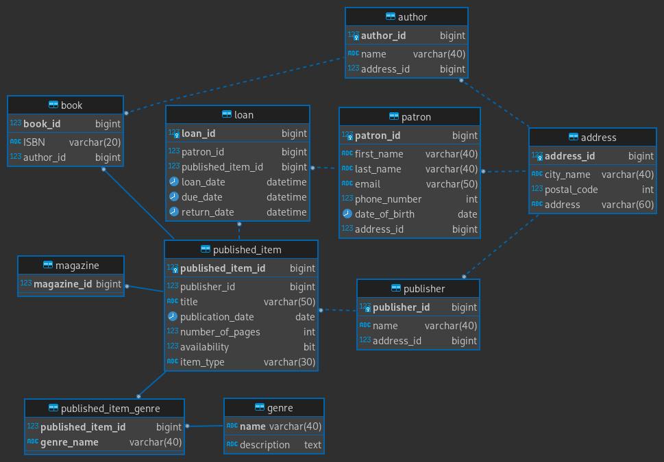

# Databases Assignment 1

By Tobias Zimmermann (cph-tz11@cphbusiness.dk)

## Table of Contents

- [Introduction](#introduction)
- [Explanations](#explanations)
  - [CAP Theorem](#cap-theorem)
  - [ACID Properties](#acid-properties)
- [Designing the Database](#designing-the-database)
- [Stored Procedures and Transactions](#stored-procedures-and-transactions)
- [Conclusion and Future Improvements](#conclusion-and-future-improvements)

## Introduction

This document briefly discusses the CAP theorem and ACID properties, and describes how they were applied during the assignment. The complete assignment can be found [here](./documents/database-assignment.pdf).

As the given task was set up in such a way that we could incrementally improve our product, multiple version of the database can be found in the [SQL](./sql) folder.

## Explanations

### CAP Theorem

The CAP theorem is a way to define how a distributed system operates. How does the system operate given specific criteria.

The three concepts in the CAP theorem are:

1. Consistency

**Consistency** states that the system state should always be same in all places.

Ex:
Given that you have two replicas of the same application.
When a request to update data is sent to application 1.
Then the data is updated on both application 1 and application 2, before the request is said to be OK.

If any update goes wrong anywhere the request is declined.

2. **Availability**

**Availability** states that the system should always be available. Availability in this context means that operations should happen even if the system becomes inconsistent because of it.

Ex:
Given that you have two replicas of the same application.
When a request to update data is sent to application 1.
Then the data is updated on both application 1, if the request goes right, the system responds with OK. However, before responding, it will also tell application 2, that it should update its data, but it does not wait to see if application 2 does it correctly.

In this example, if application 2 fails to update its data, or even a request is made to application 2 before the update happens, the responding data could be inconsistent to the data of application 1.

3. **Partition tolerance**

**Partition tolerance** states that given a partition failure, this could be a network error, the system continues to operate.

### ACID Properties

Help in making sure that we are able to perform transactions reliably.

1. Atomic

**Atomic** states that the whole transaction must finish. If one part of the transaction fails, nothing in that transaction should happen.

2. Consistent

**Consistency** states that data should always be in the correct state. An example of this could be making sure that a constraint on a column is always kept.

3. Isolated

**Isolated** means that a database should be concurrent execution safe. If two requests are made to the same data, the requests should be handled synchronously.

4. Durable

**Durable** states that any committed transaction should be saved, and available for rollbacks. If a transaction successfully completes, it is not said to be OK before the state is committed to memory.

## Designing the Database

### ER Diagram

## Stored Procedures and Transactions

## Conclusion and Future Improvements
